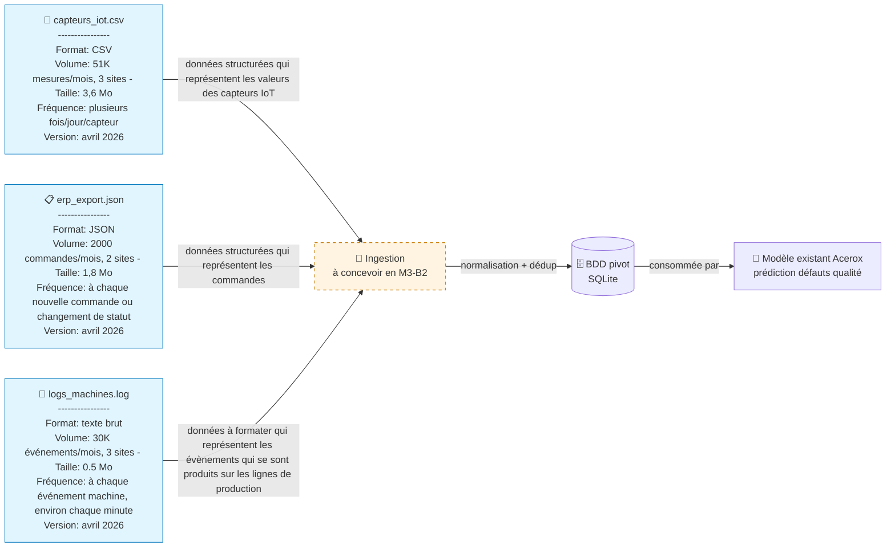

# Schéma des flux de données — Acerox Métallurgie

> Schéma Mermaid à compléter. Doit montrer :
> - **Sources** (tabulaire, textuelle)
> - **Ingestion** (transformers)
> - **BDD pivot** (si utile)
> - **Modèle** (modèle retenu)
> - **Interface graphique** utilisée par l'opérateur
> - **API de consultation du modèle**
>
> Légende explicite : qui produit, qui consomme, contraintes.

## Schéma

Exemple à transformer :

## Légende

> Reformule en 5 lignes max ce que le schéma raconte (qui produit quelle
> donnée, qui consomme, contraintes critiques).
Exemple :

- **Producteur** : les capteurs IoT des 3 sites (mesures), les machines industrielles (logs événements) et l'ERP sur 2 sites (commandes/statuts).
- **Consommateur final** : le modèle Acerox de prédiction des défauts qualité, via la BDD pivot SQLite alimentée par la couche d'ingestion.
- **Contraintes critiques** (fréquence / RGPD / qualité) : ingestion quasi continue qui peut représenter un volume important de données (ici on ne dispose que d'un mois de données), formatage obligatoire des logs texte brut, normalisation + déduplication avant stockage, contrôle de qualité des données et gouvernance des données opérationnelles.

## Décisions associées

---

*Schéma produit par Célia, DD-MM-YYYY.*
