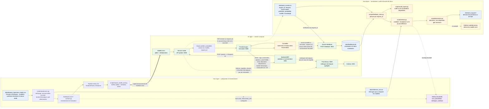

# Flux de données — Emploi-Retour

Ce schéma décrit le cas d'usage de priorisation des personnes en recherche
d'emploi vers un accompagnement renforcé. Il distingue la préparation et
l'entraînement hors ligne, le scoring en ligne, puis le retour des annotations
pour l'audit et un éventuel réentraînement. Les flèches pleines représentent un
flux de données ; les pointillés, un flux facultatif ou une étape de contrôle.

## Schéma

```mermaid
flowchart LR
    subgraph OFF["Hors ligne — préparation et entraînement"]
        RAW["data/dataset_trajectoire_emploi.csv<br/>Dossiers historiques : variables, synthèse d'entretien et classe réelle"]
        PREP["scripts/preprocess.py<br/>nettoyage, anonymisation du texte,<br/>famille thématique, split déterministe"]
        TRAIN["Notebook §1-§7 / src/train.py<br/>entraînement et évaluation"]
        MODEL["Pipeline retenu S1<br/>RandomForest, 8 features"]
        EXPORT["scripts/export_model_prod.py<br/>artefact joblib + metadata JSON"]
        REF["data/reference_set.csv<br/>350 lignes pour comparer les modèles"]
        ML["MLflow (facultatif)<br/>runs, paramètres, métriques, artefacts"]

        RAW --> PREP --> TRAIN --> MODEL --> EXPORT
        PREP --> REF
        TRAIN -.->|"si MLFLOW_TRACKING_URI configurée"| ML
    end

    subgraph ONLINE["En ligne — docker compose"]
        AGENT["Conseiller<br/>saisie des 8 champs dans le formulaire"]
        UI["Frontend nginx<br/>formulaire :8088"]
        BFF["Backend BFF<br/>validation et orchestration :8001"]
        API["Service model<br/>API /predict :8000"]
        SERVED["Modèle servi<br/>joblib + métadonnées"]
        RESULT["Classe prédite, probabilité,<br/>version du modèle, request_id"]
        FEEDBACK_API["Service feedback<br/>POST /feedback :8002"]
        DB[("data/feedbacks.db<br/>annotations et statut d'utilisation")]
        MON["Prometheus :9090<br/>métriques techniques agrégées"]
        DASH["Grafana :3001"]

        AGENT --> UI -->|"JSON : âge, ancienneté, diplôme, code ROME,<br/>statut allocataire, département,<br/>famille thématique, nationalité hors UE"| BFF
        BFF -->|"POST /predict + X-Request-ID"| API
        SERVED --> API
        API --> RESULT --> UI --> AGENT
        AGENT -.->|"canal conseiller à raccorder : request_id,<br/>classe réelle observée, commentaire facultatif"| FEEDBACK_API
        FEEDBACK_API --> DB
        API -.->|"latence, requêtes, classes et familles thématiques;<br/>pas de nationalité"| MON
        BFF -.->|"métriques techniques;<br/>pas de corps de requête"| MON
        MON --> DASH
    end

    EXPORT ==>|"copie/versionnement de l'artefact servi"| SERVED

    subgraph LOOP["Hors ligne — annotations, audit et boucle de retour"]
        JOURNAL["data/prod_scored.csv<br/>request_id, features, classe réelle*,<br/>prédiction, probabilité, modèle, horodatage"]
        JOIN["scripts/feedback_store.py<br/>jointure par request_id"]
        AUDIT["scripts/audit_equite.py<br/>audit sur les annotations disponibles"]
        RETRAIN["scripts/retrain.py<br/>candidat + évaluation sur le jeu de référence"]
        GATE["scripts/promotion.py<br/>planchers, non-régression,<br/>gain minimum"]
        DECISION["decisions_log.jsonl<br/>décision de promotion ou de rejet"]
        PROMOTED["Artefact candidat promu<br/>distinct du modèle servi"]

        DB --> JOIN
        JOURNAL --> JOIN
        JOIN --> AUDIT
        JOIN --> RETRAIN
        REF --> RETRAIN
        RETRAIN --> GATE --> DECISION
        GATE -.->|"si accepté"| PROMOTED
    end

    API -.->|"l'API renvoie un request_id;<br/>le journal temps réel est à raccorder"| JOURNAL
    JOURNAL -->|"vérification du request_id"| FEEDBACK_API
    RETRAIN -.->|"tracking facultatif"| ML

    classDef data fill:#e8f1fb,stroke:#4776a8,color:#000000
    classDef service fill:#e9f6ec,stroke:#4b8a59,color:#000000
    classDef governance fill:#fff4df,stroke:#b3832f,color:#000000
    classDef optional fill:#f2eafa,stroke:#8056a6,color:#000000
    class RAW,REF,JOURNAL,DB,DECISION data
    class UI,BFF,API,SERVED,FEEDBACK_API,MON,DASH service
    class AGENT,JOIN,AUDIT,RETRAIN,GATE,PROMOTED governance
    class ML optional
```

\* **État du dépôt de démonstration :** `scripts/build_prod_scored.py` fabrique
`data/prod_scored.csv` à partir d'un échantillon réservé du jeu historique. La
classe réelle y est donc connue et sert à simuler les annotations de conseillers
dans `data/feedbacks_simules.csv`. En exploitation, la classe réelle n'est pas
connue au moment du scoring : elle est apportée ultérieurement par le conseiller
via `/feedback`. Le service `/predict` actuel renvoie un `request_id`, mais
n'écrit pas lui-même dans `prod_scored.csv` ; le raccordement du journal de
scoring au flux en ligne reste à réaliser. Le formulaire actuel n'offre pas
non plus de saisie de feedback : l'annotation passe par l'endpoint du service
`feedback` et suppose un canal conseiller dédié.

## Légende et responsabilités

- **Producteur initial :** le système métier fournit les dossiers historiques et leur classe réelle ; `preprocess.py` nettoie les données, anonymise les courriels/téléphones dans la synthèse, dérive `famille_thematique` et prépare les partitions déterministes.
- **Producteur des entrées en ligne :** le conseiller saisit les 8 variables requises dans le formulaire. `nationalite_hors_ue` est demandée explicitement, avec l'information relative à sa finalité. Le backend transmet le payload au modèle sans réécrire cette valeur.
- **Consommateur du scoring :** le conseiller reçoit la classe, la probabilité, la version du modèle et un identifiant de requête ; le modèle chargé est un artefact figé, il n'apprend pas en ligne.
- **Retour métier :** le conseiller rattache la classe réelle observée à `request_id` via `/feedback`. SQLite stocke l'annotation ; `feedback_store.py` la joint aux features scorées pour l'audit et le réentraînement hors ligne.
- **Supervision et tracking :** Prometheus/Grafana reçoivent des métriques techniques et de drift (classes prédites, familles thématiques), jamais la nationalité ni le corps de requête. MLflow est facultatif et réservé aux runs hors ligne ; aucune inférence n'en dépend.

## Données et contraintes

| Donnée | Origine et usage | Sensibilité et maîtrise |
|---|---|---|
| Dossier historique | Fichier `dataset_trajectoire_emploi.csv`, utilisé pour préparer les features, entraîner et évaluer le modèle. | Données personnelles de démonstration ; accès au jeu brut limité. Les synthèses sont nettoyées et les téléphones/courriels détectés sont anonymisés en amont. |
| `famille_thematique` | Catégorie issue de la synthèse selon le référentiel figé ; feature du modèle et champ du formulaire/service. | Le service ne reçoit pas le texte libre de la synthèse. Les modalités sont validées par le contrat d'API. |
| `nationalite_hors_ue` | Saisie par le conseiller, feature du scénario S1 servi et axe obligatoire d'audit d'équité selon l'arbitrage J0. Une ablation dédiée S1-sans-nationalite a été évaluée sur sous-validation ; l'inclusion est maintenue provisoirement, sans prétention causale. | Donnée sensible au sens courant et proxy possible d'origine. Finalité limitée à la priorisation d'un accompagnement renforcé ; jamais de refus, sanction ou contrôle. Exclue des logs et de la supervision. Conditions C1-C7 de J0 applicables. |
| Prédiction et identifiant | Produits par `/predict` : classe, probabilité, version du modèle et `request_id`. | Ne constituent pas à eux seuls une décision : l'arbitrage humain est maintenu. Le `request_id` est nécessaire à la jointure avec le feedback. |
| Journal des dossiers scorés | Features, prédiction et identifiants, conservés dans `prod_scored.csv` pour joindre les annotations. | Peut contenir la nationalité et d'autres données personnelles ; accès et durée de conservation à encadrer selon le cycle d'audit/réentraînement. Le fichier actuel est un artefact de démonstration statique. |
| Feedback | Classe réelle observée après prise en charge, `request_id`, commentaire facultatif ; stocké dans `feedbacks.db`. | Le label devient une donnée d'entraînement. Les doublons et changements de label sont contrôlés ; le feedback ne remplace pas le dossier métier de référence. |
| Artefacts et métriques | Modèle joblib, métadonnées JSON, jeu de référence, rapports d'audit et journal de décision. | Le jeu de référence reste distinct du trafic utilisé pour feedback. La promotion est évaluée hors ligne et ne déploie pas automatiquement un candidat. |

## Décisions associées

- **Séparation hors ligne / en ligne :** entraînement, audit d'équité, réentraînement et arbitrage de promotion restent hors ligne. Les conteneurs de service ne contiennent pas de dépendance à l'entraînement ni à MLflow.
- **Contrat d'inférence :** les 8 champs du scénario S1 sont transmis au modèle sans ajout, retrait ou neutralisation côté serveur. Une entrée invalide est rejetée par validation plutôt que corrigée silencieusement.
- **Pas de boucle d'apprentissage automatique :** les feedbacks alimentent un candidat ; une politique de promotion compare candidat et production sur le jeu de référence. Le script actuel écrit un artefact promu séparé (`emploi_retour_s1_1.joblib`) et ne remplace pas le modèle servi. Son déploiement exige une procédure distincte et une revue ; il n'est pas automatique.
- **Traçabilité minimale :** `request_id` relie l'appel, le scoring et son feedback. Les logs applicatifs ne consignent pas le corps des requêtes ; les métriques de supervision n'incluent pas `nationalite_hors_ue`.
- **Conditions de mise en service :** l'AIPD et l'inscription au registre (C6) sont requises avant déploiement ; la réserve métier bloquante documentée dans le notebook demeure également à traiter.

---

*Schéma de flux du cas d'usage Emploi-Retour. La partie en ligne représente l'architecture cible ; le journal de scoring temps réel, l'interface conseiller de saisie des feedbacks et la procédure de déploiement d'un modèle promu restent à raccorder, et ne sont pas implémentés dans les services actuels.*
