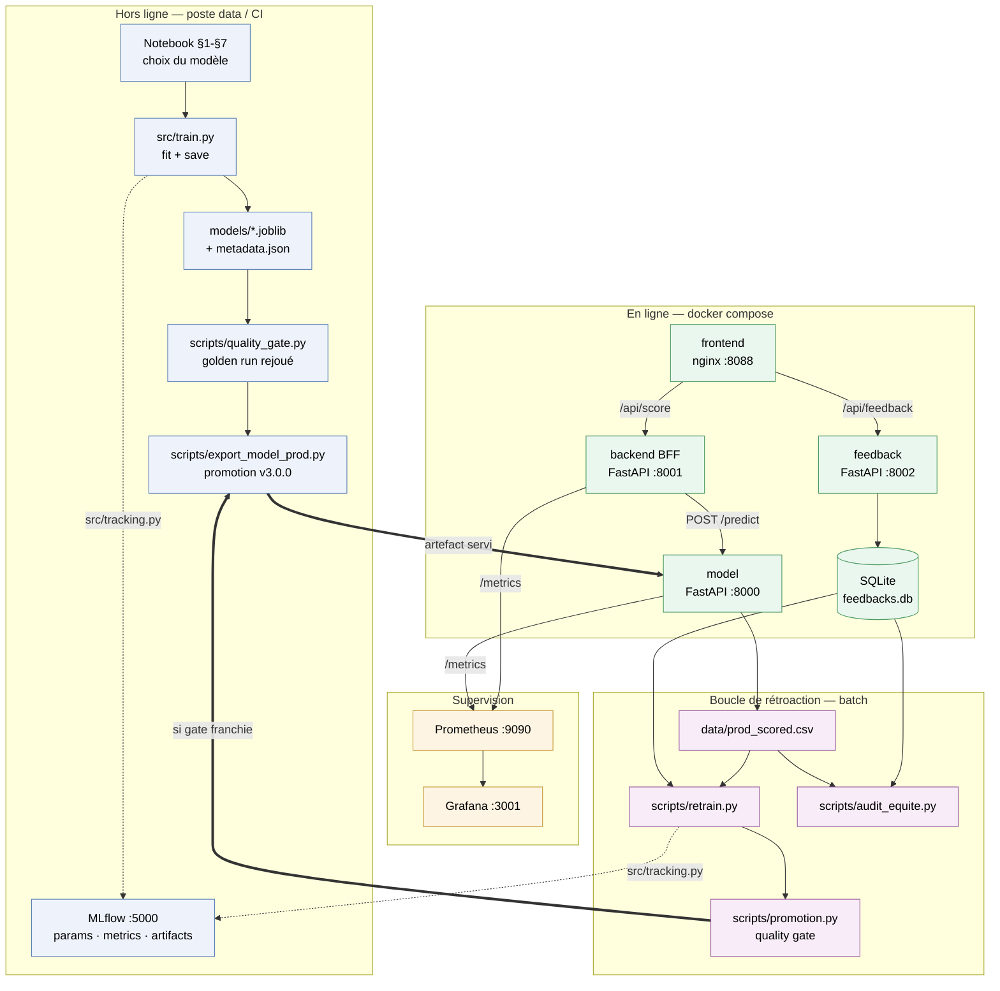

```mermaid
graph TB
  subgraph OFF["Hors ligne — poste data / CI"]
    NB["Notebook §1-§7<br/>choix du modèle"] --> TR["src/train.py<br/>fit + save"]
    TR --> ART["models/*.joblib<br/>+ metadata.json"]
    TR -.->|"src/tracking.py"| ML["MLflow :5000<br/>params · metrics · artifacts"]
    ART --> QG["scripts/quality_gate.py<br/>golden run rejoué"]
    QG --> EXP["scripts/export_model_prod.py<br/>promotion v3.0.0"]
  end

  subgraph ON["En ligne — docker compose"]
    FE["frontend<br/>nginx :8088"]
    BE["backend BFF<br/>FastAPI :8001"]
    MO["model<br/>FastAPI :8000"]
    FB["feedback<br/>FastAPI :8002"]
    DB[("SQLite<br/>feedbacks.db")]
  end

  subgraph SUP["Supervision"]
    PR["Prometheus :9090"]
    GR["Grafana :3001"]
  end

  subgraph LOOP["Boucle de rétroaction — batch"]
    PS["data/prod_scored.csv"]
    RT["scripts/retrain.py"]
    PO["scripts/promotion.py<br/>quality gate"]
    AE["scripts/audit_equite.py"]
  end

  EXP ==>|"artefact servi"| MO
  FE -->|"/api/score"| BE
  BE -->|"POST /predict"| MO
  FE -->|"/api/feedback"| FB
  FB --> DB

  MO -->|"/metrics"| PR
  BE -->|"/metrics"| PR
  PR --> GR

  MO --> PS
  DB --> RT
  PS --> RT
  PS --> AE
  DB --> AE
  RT --> PO
  PO ==>|"si gate franchie"| EXP
  RT -.->|"src/tracking.py"| ML

  classDef off fill:#eef3fb,stroke:#5b7fb5,color:#000000
  classDef on fill:#eaf7ee,stroke:#4c9a63,color:#000000
  classDef sup fill:#fdf4e3,stroke:#c79a3a,color:#000000
  classDef loop fill:#f7ecf7,stroke:#9a5ba0,color:#000000
  class NB,TR,ART,QG,EXP,ML off
  class FE,BE,MO,FB,DB on
  class PR,GR sup
  class PS,RT,PO,AE loop
```
