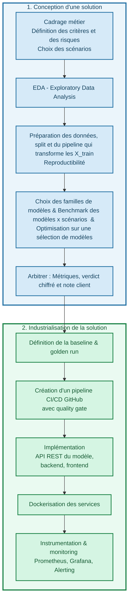

# Workflow de la démarche de modélisation de la solution IA

# TODO : reprendre les 8 phases du fiche_feuille_route_cas_usage.pdf, ça structure bien pour le WF, le notebook et le ppt

```mermaid
flowchart TD
    subgraph P1["1. Conception d'une solution"]
        A1[Cadrage métier<br/>Définition des critères et des risques<br/>Choix des scénarios]
        A2[EDA - Exploratory Data Analysis]
        A3[Préparation des données, split et du pipeline qui transforme les X_train<br/>Reproductibilité]
        A4[Choix des familles de modèles & Benchmark des modèles x scénarios  & Optimisation sur une sélection de modèles]
        A5[Arbitrer : Métriques, verdict chiffré et note client]

        A1 --> A2 --> A3 --> A4 --> A5
    end

    subgraph P2["2. Industrialisation de la solution"]
        B0[Définition de la baseline & golden run]
        B1[Création d'un pipeline CI/CD GitHub<br/>avec quality gate]
        B2[Implémentation<br/> API REST du modèle, backend, frontend]
        B3[Dockerisation des services]
        B4[Instrumentation & monitoring <br/>Prometheus, Grafana, Alerting]

        B0 --> B1 --> B2 --> B3 --> B4 
    end

    A5 --> B0

    classDef phase1 fill:#d6eaf8,stroke:#2874a6,stroke-width:2px,color:#154360
    classDef phase2 fill:#d5f5e3,stroke:#1e8449,stroke-width:2px,color:#145a32

    class A1,A2,A3,A4,A5,A6 phase1
    class B0,B1,B2,B3,B4 phase2
    style P1 fill:#ebf5fb,stroke:#2874a6,stroke-width:3px,color:#154360
    style P2 fill:#eafaf1,stroke:#1e8449,stroke-width:3px,color:#145a32
```
